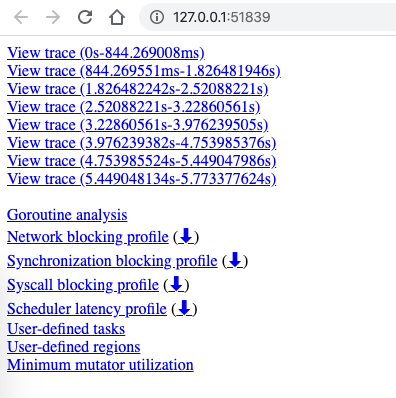
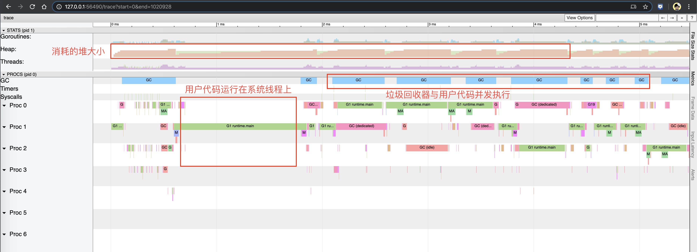

# 垃圾回收的认识

## 1. 什么是 GC，有什么作用？

`GC`，全称 `Garbage Collection`，即垃圾回收，是一种自动内存管理的机制。

当程序向操作系统申请的内存不再需要时，垃圾回收主动将其回收并供其他代码进行内存申请时候复用，或者将其归还给操作系统，这种针对内存级别资源的自动回收过程，即为垃圾回收。而负责垃圾回收的程序组件，即为垃圾回收器。

垃圾回收其实一个完美的 “Simplicity is Complicated” 的例子。一方面，程序员受益于 GC，无需操心、也不再需要对内存进行手动的申请和释放操作，GC 在程序运行时自动释放残留的内存。另一方面，GC 对程序员几乎不可见，仅在程序需要进行特殊优化时，通过提供可调控的 API，对 GC 的运行时机、运行开销进行把控的时候才得以现身。

通常，垃圾回收器的执行过程被划分为两个半独立的组件：

- 赋值器（Mutator）：这一名称本质上是在指代用户态的代码。因为对垃圾回收器而言，用户态的代码仅仅只是在修改对象之间的引用关系，也就是在对象图（对象之间引用关系的一个有向图）上进行操作。
- 回收器（Collector）：负责执行垃圾回收的代码。

## 2. 根对象到底是什么？

根对象在垃圾回收的术语中又叫做根集合，它是垃圾回收器在标记过程时最先检查的对象，包括：

1. 全局变量：程序在编译期就能确定的那些存在于程序整个生命周期的变量。
2. 执行栈：每个 goroutine 都包含自己的执行栈，这些执行栈上包含栈上的变量及指向分配的堆内存区块的指针。
3. 寄存器：寄存器的值可能表示一个指针，参与计算的这些指针可能指向某些赋值器分配的堆内存区块。

## 3. 常见的 GC 实现方式有哪些？Go 语言的 GC 使用的是什么？

所有的 GC 算法其存在形式可以归结为追踪（Tracing）和引用计数（Reference Counting）这两种形式的混合运用。

- 追踪式 GC 
  
  从根对象出发，根据对象之间的引用信息，一步步推进直到扫描完毕整个堆并确定需要保留的对象，从而回收所有可回收的对象。Go、 Java、V8 对 JavaScript 的实现等均为追踪式 GC。
- 引用计数式 GC
  
  每个对象自身包含一个被引用的计数器，当计数器归零时自动得到回收。因为此方法缺陷较多，在追求高性能时通常不被应用。Python、Objective-C 等均为引用计数式 GC。

目前比较常见的 GC 实现方式包括：

- 追踪式，分为多种不同类型，例如：
  - 标记清扫：从根对象出发，将确定存活的对象进行标记，并清扫可以回收的对象。
  - 标记整理：为了解决内存碎片问题而提出，在标记过程中，将对象尽可能整理到一块连续的内存上。
  - 增量式：将标记与清扫的过程分批执行，每次执行很小的部分，从而增量的推进垃圾回收，达到近似实时、几乎无停顿的目的。
  - 增量整理：在增量式的基础上，增加对对象的整理过程。
  - 分代式：将对象根据存活时间的长短进行分类，存活时间小于某个值的为年轻代，存活时间大于某个值的为老年代，永远不会参与回收的对象为永久代。并根据分代假设（如果一个对象存活时间不长则倾向于被回收，如果一个对象已经存活很长时间则倾向于存活更长时间）对对象进行回收。
- 引用计数：根据对象自身的引用计数来回收，当引用计数归零时立即回收。

关于各类方法的详细介绍及其实现不在本文中详细讨论。对于 Go 而言，Go 的 GC 目前使用的是无分代（对象没有代际之分）、不整理（回收过程中不对对象进行移动与整理）、并发（与用户代码并发执行）的三色标记清扫算法。原因[1]在于：

1. 对象整理的优势是解决内存碎片问题以及“允许”使用顺序内存分配器。但 Go 运行时的分配算法基于 tcmalloc，基本上没有碎片问题。 并且顺序内存分配器在多线程的场景下并不适用。Go 使用的是基于 tcmalloc 的现代内存分配算法，对对象进行整理不会带来实质性的性能提升。
2. 分代 GC 依赖分代假设，即 GC 将主要的回收目标放在新创建的对象上（存活时间短，更倾向于被回收），而非频繁检查所有对象。但 Go 的编译器会通过**逃逸分析**将大部分新生对象存储在栈上（栈直接被回收），只有那些需要长期存在的对象才会被分配到需要进行垃圾回收的堆中。也就是说，分代 GC 回收的那些存活时间短的对象在 Go 中是直接被分配到栈上，当 goroutine 死亡后栈也会被直接回收，不需要 GC 的参与，进而分代假设并没有带来直接优势。并且 Go 的垃圾回收器与用户代码并发执行，使得 STW 的时间与对象的代际、对象的 size 没有关系。Go 团队更关注于如何更好地让 GC 与用户代码并发执行（使用适当的 CPU 来执行垃圾回收），而非减少停顿时间这一单一目标上。

## 4. 三色标记法是什么？ 

理解**三色标记法**的关键是理解对象的**三色抽象**以及**波面（wavefront）推进**这两个概念。三色抽象只是一种描述追踪式回收器的方法，在实践中并没有实际含义，它的重要作用在于从逻辑上严密推导标记清理这种垃圾回收方法的正确性。也就是说，当我们谈及三色标记法时，通常指标记清扫的垃圾回收。

从垃圾回收器的视角来看，三色抽象规定了三种不同类型的对象，并用不同的颜色相称：

- 白色对象（可能死亡）：未被回收器访问到的对象。在回收开始阶段，所有对象均为白色，当回收结束后，白色对象均不可达。
- 灰色对象（波面）：已被回收器访问到的对象，但回收器需要对其中的一个或多个指针进行扫描，因为他们可能还指向白色对象。
- 黑色对象（确定存活）：已被回收器访问到的对象，其中所有字段都已被扫描，黑色对象中任何一个指针都不可能直接指向白色对象。

这样三种不变性所定义的回收过程其实是一个**波面**不断前进的过程，这个波面同时也是黑色对象和白色对象的边界，灰色对象就是这个波面。

当垃圾回收开始时，只有白色对象。随着标记过程开始进行时，灰色对象开始出现（着色），这时候波面便开始扩大。当一个对象的所有子节点均完成扫描时，会被着色为黑色。当整个堆遍历完成时，只剩下黑色和白色对象，这时的黑色对象为可达对象，即存活；而白色对象为不可达对象，即死亡。这个过程可以视为以灰色对象为波面，将黑色对象和白色对象分离，使波面不断向前推进，直到所有可达的灰色对象都变为黑色对象为止的过程。如下图所示：


图中展示了根对象、可达对象、不可达对象，黑、灰、白对象以及波面之间的关系。

## 5. STW 是什么意思？

`STW` 可以是 `Stop the World` 的缩写，也可以是 `Start the World` 的缩写。通常意义上指指代从 `Stop the World` 这一动作发生时到 `Start the World` 这一动作发生时这一段时间间隔，即万物静止。STW 在垃圾回收过程中为了保证实现的正确性、防止无止境的内存增长等问题而不可避免的需要停止赋值器进一步操作对象图的一段过程。

在这个过程中整个用户代码被停止或者放缓执行， `STW` 越长，对用户代码造成的影响（例如延迟）就越大，早期 Go 对垃圾回收器的实现中 `STW` 长达几百毫秒，对时间敏感的实时通信等应用程序会造成巨大的影响。我们来看一个例子：

```go
package main

import (
	"runtime"
	"time"
)

func main() {
	go func() {
		for {
		}
	}()

	time.Sleep(time.Millisecond)
	runtime.GC()
	println("OK")
}
```

上面的这个程序在 Go 1.14 以前永远都不会输出 `OK`，其罪魁祸首是进入 STW 这一操作的执行无限制的被延长。

尽管 STW 如今已经优化到了半毫秒级别以下，但这个程序被卡死原因是由于需要进入 STW 导致的。原因在于，GC 在需要进入 STW 时，需要通知并让所有的用户态代码停止，但是 `for {}` 所在的 goroutine 永远都不会被中断，从而始终无法进入 STW 阶段。实际实践中也是如此，当程序的某个 goroutine 长时间得不到停止，强行拖慢进入 STW 的时机，这种情况下造成的影响（卡死）是非常可怕的。好在自 Go 1.14 之后，这类 goroutine 能够被异步地抢占，从而使得进入 STW 的时间不会超过抢占信号触发的周期，程序也不会因为仅仅等待一个 goroutine 的停止而停顿在进入 STW 之前的操作上。

## 6. 如何观察 Go GC？

我们以下面的程序为例，先使用四种不同的方式来介绍如何观察 GC，并在后面的问题中通过几个详细的例子再来讨论如何优化 GC。

```go
package main

func allocate() {
	_ = make([]byte, 1<<20)
}

func main() {
	for n := 1; n < 100000; n++ {
		allocate()
	}
}
```

### 方式1：`GODEBUG=gctrace=1`

我们首先可以通过

```
$ go build -o main
$ GODEBUG=gctrace=1 ./main

gc 1 @0.000s 2%: 0.009+0.23+0.004 ms clock, 0.11+0.083/0.019/0.14+0.049 ms cpu, 4->6->2 MB, 5 MB goal, 12 P
scvg: 8 KB released
scvg: inuse: 3, idle: 60, sys: 63, released: 57, consumed: 6 (MB)
gc 2 @0.001s 2%: 0.018+1.1+0.029 ms clock, 0.22+0.047/0.074/0.048+0.34 ms cpu, 4->7->3 MB, 5 MB goal, 12 P
scvg: inuse: 3, idle: 60, sys: 63, released: 56, consumed: 7 (MB)
gc 3 @0.003s 2%: 0.018+0.59+0.011 ms clock, 0.22+0.073/0.008/0.042+0.13 ms cpu, 5->6->1 MB, 6 MB goal, 12 P
scvg: 8 KB released
scvg: inuse: 2, idle: 61, sys: 63, released: 56, consumed: 7 (MB)
gc 4 @0.003s 4%: 0.019+0.70+0.054 ms clock, 0.23+0.051/0.047/0.085+0.65 ms cpu, 4->6->2 MB, 5 MB goal, 12 P
scvg: 8 KB released
scvg: inuse: 3, idle: 60, sys: 63, released: 56, consumed: 7 (MB)
scvg: 8 KB released
scvg: inuse: 4, idle: 59, sys: 63, released: 56, consumed: 7 (MB)
gc 5 @0.004s 12%: 0.021+0.26+0.49 ms clock, 0.26+0.046/0.037/0.11+5.8 ms cpu, 4->7->3 MB, 5 MB goal, 12 P
scvg: inuse: 5, idle: 58, sys: 63, released: 56, consumed: 7 (MB)
gc 6 @0.005s 12%: 0.020+0.17+0.004 ms clock, 0.25+0.080/0.070/0.053+0.051 ms cpu, 5->6->1 MB, 6 MB goal, 12 P
scvg: 8 KB released
scvg: inuse: 1, idle: 62, sys: 63, released: 56, consumed: 7 (MB)
```

在这个日志中可以观察到两类不同的信息：

```
gc 1 @0.000s 2%: 0.009+0.23+0.004 ms clock, 0.11+0.083/0.019/0.14+0.049 ms cpu, 4->6->2 MB, 5 MB goal, 12 P
gc 2 @0.001s 2%: 0.018+1.1+0.029 ms clock, 0.22+0.047/0.074/0.048+0.34 ms cpu, 4->7->3 MB, 5 MB goal, 12 P
...
```

以及：

```
scvg: 8 KB released
scvg: inuse: 3, idle: 60, sys: 63, released: 57, consumed: 6 (MB)
scvg: inuse: 3, idle: 60, sys: 63, released: 56, consumed: 7 (MB)
...
```

对于用户代码向运行时申请内存产生的垃圾回收：

```
gc 2 @0.001s 2%: 0.018+1.1+0.029 ms clock, 0.22+0.047/0.074/0.048+0.34 ms cpu, 4->7->3 MB, 5 MB goal, 12 P
```

含义由下表所示：

| 字段  | 含义                                           |
| :---- | :--------------------------------------------- |
| gc 2  | 第二个 GC 周期                                 |
| 0.001 | 程序开始后的 0.001 秒                          |
| 2%    | 该 GC 周期中 CPU 的使用率                      |
| 0.018 | 标记开始时， STW 所花费的时间（wall clock）    |
| 1.1   | 标记过程中，并发标记所花费的时间（wall clock） |
| 0.029 | 标记终止时， STW 所花费的时间（wall clock）    |
| 0.22  | 标记开始时， STW 所花费的时间（cpu time）      |
| 0.047 | 标记过程中，标记辅助所花费的时间（cpu time）   |
| 0.074 | 标记过程中，并发标记所花费的时间（cpu time）   |
| 0.048 | 标记过程中，GC 空闲的时间（cpu time）          |
| 0.34  | 标记终止时， STW 所花费的时间（cpu time）      |
| 4     | 标记开始时，堆的大小的实际值                   |
| 7     | 标记结束时，堆的大小的实际值                   |
| 3     | 标记结束时，标记为存活的对象大小               |
| 5     | 标记结束时，堆的大小的预测值                   |
| 12    | P 的数量                                       |

> wall clock 是指开始执行到完成所经历的实际时间，包括其他程序和本程序所消耗的时间；
> cpu time 是指特定程序使用 CPU 的时间；
> 他们存在以下关系：
>
> - wall clock < cpu time: 充分利用多核
> - wall clock ≈ cpu time: 未并行执行
> - wall clock > cpu time: 多核优势不明显

对于运行时向操作系统申请内存产生的垃圾回收（向操作系统归还多余的内存）：

```
scvg: 8 KB released
scvg: inuse: 3, idle: 60, sys: 63, released: 57, consumed: 6 (MB)
```

含义由下表所示：

| 字段          | 含义                                                         |
| :------------ | :----------------------------------------------------------- |
| 8 KB released | 向操作系统归还了 8 KB 内存                                   |
| 3             | 已经分配给用户代码、正在使用的总内存大小 (MB) |
| 60            | 空闲以及等待归还给操作系统的总内存大小（MB） |
| 63            | 通知操作系统中保留的内存大小（MB） |
| 57            | 已经归还给操作系统的（或者说还未正式申请）的内存大小（MB） |
| 6             | 已经从操作系统中申请的内存大小（MB） |

### 方式2：`go tool trace`

`go tool trace` 的主要功能是将统计而来的信息以一种可视化的方式展示给用户。要使用此工具，可以通过调用 trace API：

```go
package main

func main() {
	f, _ := os.Create("trace.out")
	defer f.Close()
	trace.Start(f)
	defer trace.Stop()
	(...)
}
```

并通过 

```
$ go tool trace trace.out
2019/12/30 15:50:33 Parsing trace...
2019/12/30 15:50:38 Splitting trace...
2019/12/30 15:50:45 Opening browser. Trace viewer is listening on http://127.0.0.1:51839
```

命令来启动可视化界面：




选择第一个链接可以获得如下图示：



右上角的问号可以打开帮助菜单，主要使用方式包括：

- w/s 键可以用于放大或者缩小视图
- a/d 键可以用于左右移动
- 按住 Shift 可以选取多个事件

### 方式3：`debug.ReadGCStats`

此方式可以通过代码的方式来直接实现对感兴趣指标的监控，例如我们希望每隔一秒钟监控一次 GC 的状态：

```go
func printGCStats() {
	t := time.NewTicker(time.Second)
	s := debug.GCStats{}
	for {
		select {
		case <-t.C:
			debug.ReadGCStats(&s)
			fmt.Printf("gc %d last@%v, PauseTotal %v\n", s.NumGC, s.LastGC, s.PauseTotal)
		}
	}
}
func main() {
	go printGCStats()
	(...)
}
```

我们能够看到如下输出：

```go
$ go run main.go

gc 4954 last@2019-12-30 15:19:37.505575 +0100 CET, PauseTotal 29.901171ms
gc 9195 last@2019-12-30 15:19:38.50565 +0100 CET, PauseTotal 77.579622ms
gc 13502 last@2019-12-30 15:19:39.505714 +0100 CET, PauseTotal 128.022307ms
gc 17555 last@2019-12-30 15:19:40.505579 +0100 CET, PauseTotal 182.816528ms
gc 21838 last@2019-12-30 15:19:41.505595 +0100 CET, PauseTotal 246.618502ms
```

### 方式4：`runtime.ReadMemStats`

除了使用 debug 包提供的方法外，还可以直接通过运行时的内存相关的 API 进行监控：

```go
func printMemStats() {
	t := time.NewTicker(time.Second)
	s := runtime.MemStats{}

	for {
		select {
		case <-t.C:
			runtime.ReadMemStats(&s)
			fmt.Printf("gc %d last@%v, next_heap_size@%vMB\n", s.NumGC, time.Unix(int64(time.Duration(s.LastGC).Seconds()), 0), s.NextGC/(1<<20))
		}
	}
}
func main() {
	go printMemStats()
	(...)
}
```

```go
$ go run main.go

gc 4887 last@2019-12-30 15:44:56 +0100 CET, next_heap_size@4MB
gc 10049 last@2019-12-30 15:44:57 +0100 CET, next_heap_size@4MB
gc 15231 last@2019-12-30 15:44:58 +0100 CET, next_heap_size@4MB
gc 20378 last@2019-12-30 15:44:59 +0100 CET, next_heap_size@6MB
```

当然，后两种方式能够监控的指标很多，读者可以自行查看 `debug.GCStats` [2] 和 
`runtime.MemStats` [3] 的字段，这里不再赘述。

## 7. 有了 GC，为什么还会发生内存泄露？

在一个具有 GC 的语言中，我们常说的内存泄漏，用严谨的话来说应该是：预期的能很快被释放的内存由于附着在了长期存活的内存上、或生命期意外地被延长，导致预计能够立即回收的内存而长时间得不到回收。

在 Go 中，由于 goroutine 的存在，所谓的内存泄漏除了附着在长期对象上之外，还存在多种不同的形式。

### 形式1：预期能被快速释放的内存因被根对象引用而没有得到迅速释放

当有一个全局对象时，可能不经意间将某个变量附着在其上，且忽略的将其进行释放，则该内存永远不会得到释放。例如：

```go
var cache = map[interface{}]interface{}{}

func keepalloc() {
	for i := 0; i < 10000; i++ {
		m := make([]byte, 1<<10)
		cache[i] = m
	}
}
```

### 形式2：goroutine 泄漏

Goroutine 作为一种逻辑上理解的轻量级线程，需要维护执行用户代码的上下文信息。在运行过程中也需要消耗一定的内存来保存这类信息，而这些内存在目前版本的 Go 中是不会被释放的。因此，如果一个程序持续不断地产生新的 goroutine、且不结束已经创建的 goroutine 并复用这部分内存，就会造成内存泄漏的现象，例如：

```go
func keepalloc2() {
	for i := 0; i < 100000; i++ {
		go func() {
			select {}
		}()
	}
}
```

### 验证

我们可以通过如下形式来调用上述两个函数：

```go
package main

import (
	"os"
	"runtime/trace"
)

func main() {
	f, _ := os.Create("trace.out")
	defer f.Close()
	trace.Start(f)
	defer trace.Stop()
	keepalloc()
	keepalloc2()
}
```

运行程序：

```shell
go run main.go
```

会看到程序中生成了 `trace.out` 文件，我们可以使用 `go tool trace trace.out` 命令得到下图：


可以看到，图中的 Heap 在持续增长，没有内存被回收，产生了内存泄漏的现象。

值得一提的是，这种形式的 goroutine 泄漏还可能由 channel 泄漏导致。而 channel 的泄漏本质上与 goroutine 泄漏存在直接联系。Channel 作为一种同步原语，会连接两个不同的 goroutine，如果一个 goroutine 尝试向一个没有接收方的无缓冲 channel 发送消息，则该 goroutine 会被永久的休眠，整个 goroutine 及其执行栈都得不到释放，例如：

```go
var ch = make(chan struct{})

func keepalloc3() {
	for i := 0; i < 100000; i++ {
		// 没有接收方，goroutine 会一直阻塞
		go func() { ch <- struct{}{} }()
	}
}
```

## 8. 并发标记清除法的难点是什么？

在没有用户态代码并发修改`三色抽象`的情况下，回收可以正常结束。但是并发回收的根本问题在于，用户态代码在回收过程中会并发地更新对象图，从而造成赋值器和回收器可能对对象图的结构产生不同的认知。这时以一个固定的三色波面作为回收过程前进的边界则不再合理。

我们不妨考虑赋值器写操作的例子：

| 时序 | 回收器               | 赋值器             | 说明                                                         |
| ---- | -------------------- | ------------------ | ------------------------------------------------------------ |
| 1    | shade(A, gray)       |                    | 回收器：根对象的子节点着色为灰色对象                         |
| 2    | shade(C, black) |                    | 回收器：当所有子节点着色为灰色后，将节点着为黑色             |
| 3    |                      | C.ref3 = C.ref2.ref1   | 赋值器：并发的修改了 C 的子节点                              |
| 4    |                      | A.ref1 = nil | 赋值器：并发的修改了 A 的子节点                              |
| 5    | shade(A.ref1, gray)  |                    | 回收器：进一步灰色对象的子节点并着色为灰色对象，这时由于 `A.ref1` 为 `nil`，什么事情也没有发生 |
| 6    | shade(A, black)      |                    | 回收器：由于所有子节点均已标记，回收器也不会重新扫描已经被标记为黑色的对象，此时 A 被着色为黑色，`scan(A)` 什么也不会发生，进而 B 在此次回收过程中永远不会被标记为黑色，进而错误地被回收。 |

- 初始状态：假设某个黑色对象 C 指向某个灰色对象 A ，而 A 指向白色对象 B；
- `C.ref3 = C.ref2.ref1`：赋值器并发地将黑色对象 C 指向（ref3）了白色对象 B；
- `A.ref1 = nil`：移除灰色对象 A 对白色对象 B 的引用（ref2）；
- 最终状态：在继续扫描的过程中，白色对象 B 永远不会被标记为黑色对象了（回收器不会重新扫描黑色对象），进而对象 B 被错误地回收。

![gc-mutator]./assets/gc-mutator.png)

总而言之，并发标记清除中面临的一个根本问题就是如何保证标记与清除过程的正确性。

## 9. 什么是写屏障、混合写屏障，如何实现？

要讲清楚写屏障，就需要理解三色标记清除算法中的**强弱不变性**以及**赋值器的颜色**，理解他们需要一定的抽象思维。写屏障是一个在并发垃圾回收器中才会出现的概念，垃圾回收器的正确性体现在：**不应出现对象的丢失，也不应错误的回收还不需要回收的对象。**

可以证明，当以下两个条件同时满足时会破坏垃圾回收器的正确性：

- **条件 1**: 赋值器修改对象图，导致某一黑色对象引用白色对象；
- **条件 2**: 从灰色对象出发，到达白色对象的、未经访问过的路径被赋值器破坏。

只要能够避免其中任何一个条件，则不会出现对象丢失的情况，因为：

- 如果条件 1 被避免，则所有白色对象均被灰色对象引用，没有白色对象会被遗漏；
- 如果条件 2 被避免，即便白色对象的指针被写入到黑色对象中，但从灰色对象出发，总存在一条没有访问过的路径，从而找到到达白色对象的路径，白色对象最终不会被遗漏。

我们不妨将三色不变性所定义的波面根据这两个条件进行削弱：

- 当满足原有的三色不变性定义（或上面的两个条件都不满足时）的情况称为**强三色不变性（strong tricolor invariant）**
- 当赋值器令黑色对象引用白色对象时（满足条件 1 时）的情况称为**弱三色不变性（weak tricolor invariant）**

当赋值器进一步破坏灰色对象到达白色对象的路径时（进一步满足条件 2 时），即打破弱三色不变性，
也就破坏了回收器的正确性；或者说，在破坏强弱三色不变性时必须引入额外的辅助操作。
弱三色不变形的好处在于：**只要存在未访问的能够到达白色对象的路径，就可以将黑色对象指向白色对象。**

如果我们考虑并发的用户态代码，回收器不允许同时停止所有赋值器，就是涉及了存在的多个不同状态的赋值器。为了对概念加以明确，还需要换一个角度，把回收器视为对象，把赋值器视为影响回收器这一对象的实际行为（即影响 GC 周期的长短），从而引入赋值器的颜色：

- 黑色赋值器：已经由回收器扫描过，不会再次对其进行扫描。
- 灰色赋值器：尚未被回收器扫描过，或尽管已经扫描过但仍需要重新扫描。

赋值器的颜色对回收周期的结束产生影响：

- 如果某种并发回收器允许灰色赋值器的存在，则必须在回收结束之前重新扫描对象图。
- 如果重新扫描过程中发现了新的灰色或白色对象，回收器还需要对新发现的对象进行追踪，但是在新追踪的过程中，赋值器仍然可能在其根中插入新的非黑色的引用，如此往复，直到重新扫描过程中没有发现新的白色或灰色对象。

于是，在允许灰色赋值器存在的算法，最坏的情况下，回收器只能将所有赋值器线程停止才能完成其跟对象的完整扫描，也就是我们所说的 STW。

为了确保强弱三色不变性的并发指针更新操作，需要通过赋值器屏障技术来保证指针的读写操作一致。因此我们所说的 Go 中的写屏障、混合写屏障，其实是指赋值器的写屏障，赋值器的写屏障作为一种同步机制，使赋值器在进行指针写操作时，能够“通知”回收器，进而不会破坏弱三色不变性。

有两种非常经典的写屏障：Dijkstra 插入屏障和 Yuasa 删除屏障。

灰色赋值器的 Dijkstra 插入屏障的基本思想是避免满足条件 1：

```go
// 灰色赋值器 Dijkstra 插入屏障
func DijkstraWritePointer(slot *unsafe.Pointer, ptr unsafe.Pointer) {
    shade(ptr)
    *slot = ptr
}
```

为了防止黑色对象指向白色对象，应该假设 `*slot` 可能会变为黑色，为了确保 `ptr` 不会在被赋值到 `*slot` 前变为白色，`shade(ptr)` 会先将指针 `ptr` 标记为灰色，进而避免了条件 1。如图所示：

![]./assets/gc-wb-dijkstra.png)

Dijkstra 插入屏障的好处在于可以立刻开始并发标记。但存在两个缺点：

1. 由于 Dijkstra 插入屏障的“保守”，在一次回收过程中可能会残留一部分对象没有回收成功，只有在下一个回收过程中才会被回收；
2. 在标记阶段中，每次进行指针赋值操作时，都需要引入写屏障，这无疑会增加大量性能开销；为了避免造成性能问题，Go 团队在最终实现时，没有为所有栈上的指针写操作，启用写屏障，而是当发生栈上的写操作时，将栈标记为灰色，但此举产生了灰色赋值器，将会需要标记终止阶段 STW 时对这些栈进行重新扫描。

另一种比较经典的写屏障是黑色赋值器的 Yuasa 删除屏障。其基本思想是避免满足条件 2：

```go
// 黑色赋值器 Yuasa 屏障
func YuasaWritePointer(slot *unsafe.Pointer, ptr unsafe.Pointer) {
    shade(*slot)
    *slot = ptr
}
```

为了防止丢失从灰色对象到白色对象的路径，应该假设 `*slot` 可能会变为黑色，为了确保 `ptr` 不会在被赋值到 `*slot` 前变为白色，`shade(*slot)` 会先将 `*slot` 标记为灰色，进而该写操作总是创造了一条灰色到灰色或者灰色到白色对象的路径，进而避免了条件 2。

Yuasa 删除屏障的优势则在于不需要标记结束阶段的重新扫描，结束时候能够准确的回收所有需要回收的白色对象。缺陷是 Yuasa 删除屏障会拦截写操作，进而导致波面的退后，产生“冗余”的扫描：


Go 在 1.8 的时候为了简化 GC 的流程，同时减少标记终止阶段的重扫成本，将 Dijkstra 插入屏障和 Yuasa 删除屏障进行混合，形成混合写屏障。该屏障提出时的基本思想是：**对正在被覆盖的对象进行着色，且如果当前栈未扫描完成，则同样对指针进行着色。**

但在最终实现时原提案[4]中对 `ptr` 的着色还额外包含对执行栈的着色检查，但由于时间有限，并未完整实现过，所以混合写屏障在目前的实现伪代码是：

```go
// 混合写屏障
func HybridWritePointerSimple(slot *unsafe.Pointer, ptr unsafe.Pointer) {
	shade(*slot)
	shade(ptr)
	*slot = ptr
}
```

在这个实现中，如果无条件对引用双方进行着色，自然结合了 Dijkstra 和 Yuasa 写屏障的优势，但缺点也非常明显，因为着色成本是双倍的，而且编译器需要插入的代码也成倍增加，随之带来的结果就是编译后的二进制文件大小也进一步增加。为了针对写屏障的性能进行优化，Go 1.10 前后，Go 团队随后实现了批量写屏障机制。其基本想法是将需要着色的指针统一写入一个缓存，每当缓存满时统一对缓存中的所有 `ptr` 指针进行着色。
