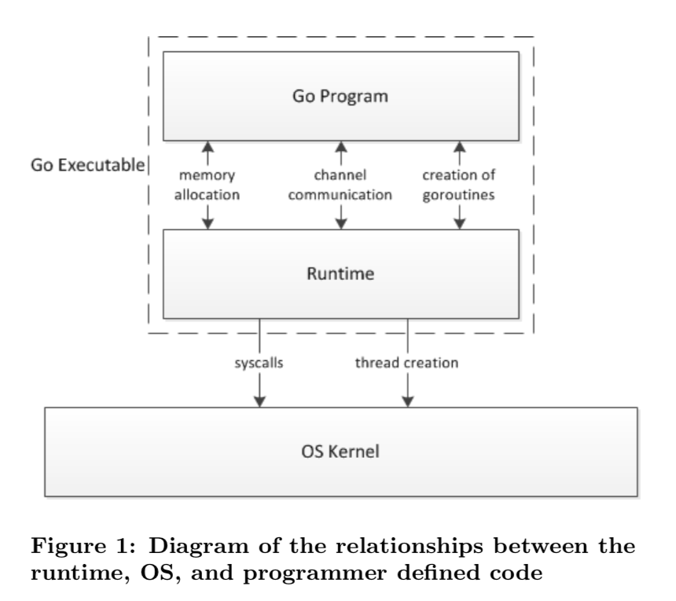
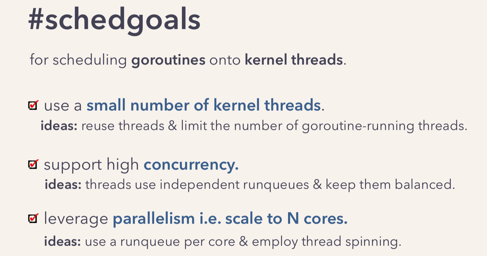
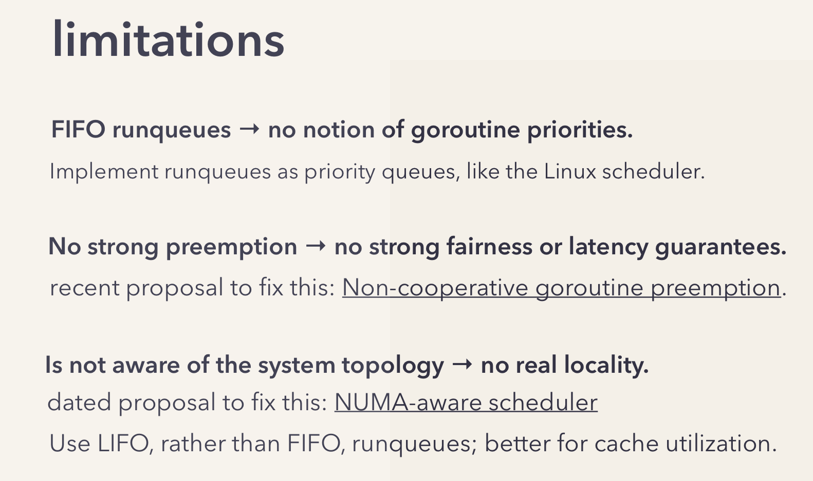
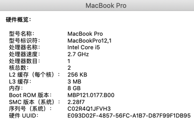
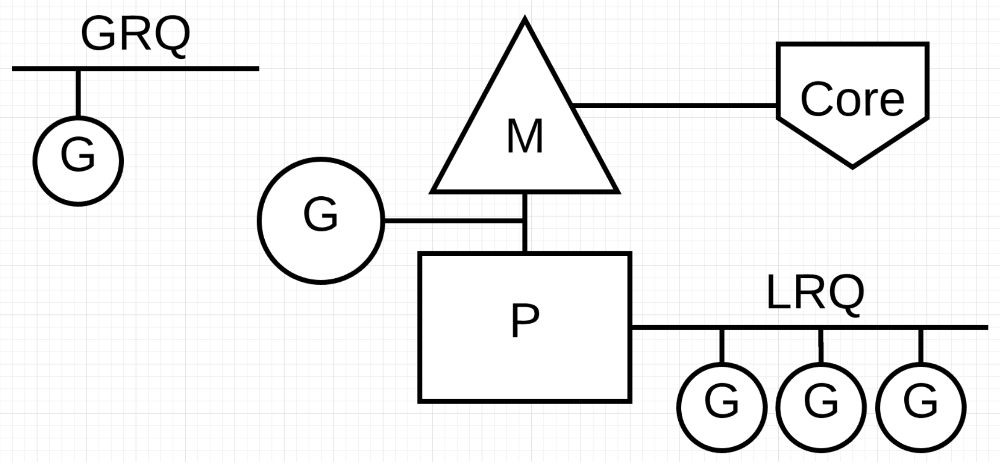

# 什么是 scheduler
Go 程序的执行由两层组成：Go Program，Runtime，即用户程序和运行时。它们之间通过函数调用来实现内存管理、channel 通信、goroutines 创建等功能。用户程序进行的系统调用都会被 Runtime 拦截，以此来帮助它进行调度以及垃圾回收相关的工作。

一个展现了全景式的关系如下图：



# 为什么要 scheduler

Go scheduler 可以说是 Go 运行时的一个最重要的部分了。Runtime 维护所有的 goroutines，并通过 scheduler 来进行调度。Goroutines 和 threads 是独立的，但是 goroutines 要依赖 threads 才能执行。

Go 程序执行的高效和 scheduler 的调度是分不开的。

# scheduler 底层原理

实际上在操作系统看来，所有的程序都是在执行多线程。将 goroutines 调度到线程上执行，仅仅是 runtime 层面的一个概念，在操作系统之上的层面。

有三个基础的结构体来实现 goroutines 的调度。g，m，p。

`g` 代表一个 goroutine，它包含：表示 goroutine 栈的一些字段，指示当前 goroutine 的状态，指示当前运行到的指令地址，也就是 PC 值。

`m` 表示内核线程，包含正在运行的 goroutine 等字段。

`p` 代表一个虚拟的 Processor，它维护一个处于 Runnable 状态的 g 队列，`m` 需要获得 `p` 才能运行 `g`。

当然还有一个核心的结构体：`sched`，它总览全局。

Runtime 起始时会启动一些 G：垃圾回收的 G，执行调度的 G，运行用户代码的 G；并且会创建一个 M 用来开始 G 的运行。随着时间的推移，更多的 G 会被创建出来，更多的 M 也会被创建出来。

当然，在 Go 的早期版本，并没有 p 这个结构体，`m` 必须从一个全局的队列里获取要运行的 `g`，因此需要获取一个全局的锁，当并发量大的时候，锁就成了瓶颈。后来在大神 Dmitry Vyokov 的实现里，加上了 `p` 结构体。每个 `p` 自己维护一个处于 Runnable 状态的 `g` 的队列，解决了原来的全局锁问题。

Go scheduler 的目标：

> For scheduling goroutines onto kernel threads.



Go scheduler 的核心思想是：

1. reuse threads；
2. 限制同时运行（不包含阻塞）的线程数为 N，N 等于 CPU 的核心数目；
3. 线程私有的 runqueues，并且可以从其他线程 stealing goroutine 来运行，线程阻塞后，可以将 runqueues 传递给其他线程。

为什么需要 P 这个组件，直接把 runqueues 放到 M 不行吗？

> You might wonder now, why have contexts at all? Can't we just put the runqueues on the threads and get rid of contexts? Not really. The reason we have contexts is so that we can hand them off to other threads if the running thread needs to block for some reason.

> An example of when we need to block, is when we call into a syscall. Since a thread cannot both be executing code and be blocked on a syscall, we need to hand off the context so it can keep scheduling.

翻译一下，当一个线程阻塞的时候，将和它绑定的 P 上的 goroutines 转移到其他线程。

Go scheduler 会启动一个后台线程 sysmon，用来检测长时间（超过 10 ms）运行的 goroutine，将其调度到 global runqueues。这是一个全局的 runqueue，优先级比较低，以示惩罚。



## 总览

通常讲到 Go scheduler 都会提到 GPM 模型，我们来一个个地看。

下图是我使用的 mac 的硬件信息，只有 2 个核。



但是配上 CPU 的超线程，1 个核可以变成 2 个，所以当我在 mac 上运行下面的程序时，会打印出 4。

```go
func main() {
	// NumCPU 返回当前进程可以用到的逻辑核心数
	fmt.Println(runtime.NumCPU())
}
```

因为 NumCPU 返回的是逻辑核心数，而非物理核心数，所以最终结果是 4。

Go 程序启动后，会给每个逻辑核心分配一个 P（Logical Processor）；同时，会给每个 P 分配一个 M（Machine，表示内核线程），这些内核线程仍然由 OS scheduler 来调度。

总结一下，当我在本地启动一个 Go 程序时，会得到 4 个系统线程去执行任务，每个线程会搭配一个 P。

在初始化时，Go 程序会有一个 G（initial Goroutine），执行指令的单位。G 会在 M 上得到执行，内核线程是在 CPU 核心上调度，而 G 则是在 M 上进行调度。

G、P、M 都说完了，还有两个比较重要的组件没有提到： 全局可运行队列（GRQ）和本地可运行队列（LRQ）。 LRQ 存储本地（也就是具体的 P）的可运行 goroutine，GRQ 存储全局的可运行 goroutine，这些 goroutine 还没有分配到具体的 P。



Go scheduler 是 Go runtime 的一部分，它内嵌在 Go 程序里，和 Go 程序一起运行。因此它运行在用户空间，在 kernel 的上一层。和 Os scheduler 抢占式调度（preemptive）不一样，Go scheduler 采用协作式调度（cooperating）。

> Being a cooperating scheduler means the scheduler needs well-defined user space events that happen at safe points in the code to make scheduling decisions.

协作式调度一般会由用户设置调度点，例如 python 中的 yield 会告诉 Os scheduler 可以将我调度出去了。 

但是由于在 Go 语言里，goroutine 调度的事情是由 Go runtime 来做，并非由用户控制，所以我们依然可以将 Go scheduler 看成是抢占式调度，因为用户无法预测调度器下一步的动作是什么。

和线程类似，goroutine 的状态也是三种（简化版的）：

|状态|解释|
|---|---|
|Waiting| 等待状态，goroutine 在等待某件事的发生。例如等待网络数据、硬盘；调用操作系统 API；等待内存同步访问条件 ready，如 atomic, mutexes |
|Runnable| 就绪状态，只要给 M 我就可以运行|
|Executing| 运行状态。goroutine 在 M 上执行指令，这是我们想要的 |

下面这张 GPM 全局的运行示意图见得比较多，可以留着，看完后面的系列文章之后再回头来看，还是很有感触的：


