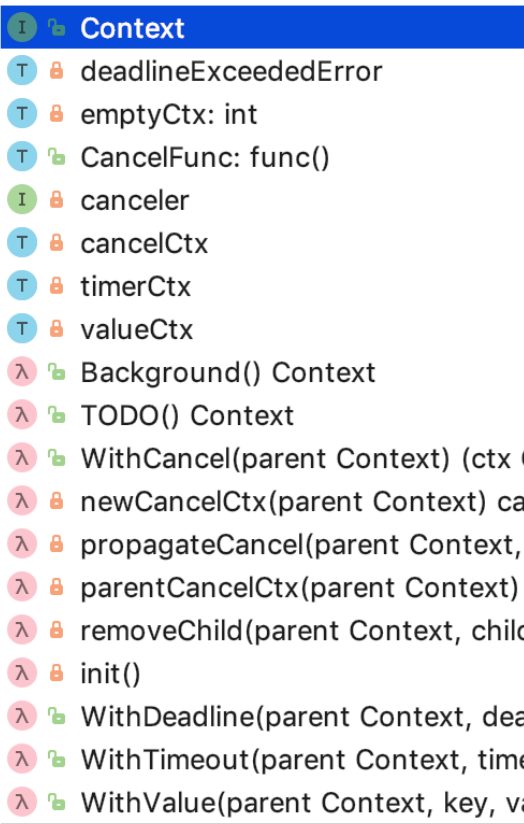
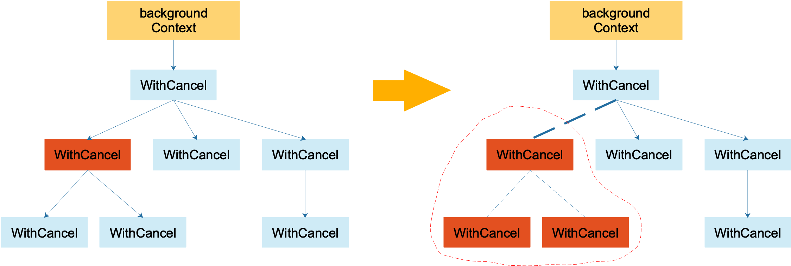

context 包的代码并不长，`context.go` 文件总共不到 500 行，其中还有很多大段的注释，代码可能也就 200 行左右的样子，是一个非常值得研究的代码库。

先看一张整体的图：



|类型|名称|作用|
|---|---|---|
|Context| 接口 | 定义了 Context 接口的四个方法 |
|emptyCtx| 结构体 | 实现了 Context 接口，它其实是个空的 context|
|CancelFunc| 函数 | 取消函数 |
|canceler| 接口 | context 取消接口，定义了两个方法 |
|cancelCtx| 结构体 | 可以被取消 |
|timerCtx| 结构体 | 超时会被取消 |
|valueCtx| 结构体 | 可以存储 k-v 对 |
|Background| 函数 | 返回一个空的 context，常作为根 context |
|TODO| 函数 | 返回一个空的 context，常用于重构时期，没有合适的 context 可用 |
|WithCancel| 函数 | 基于父 context，生成一个可以取消的 context |
|newCancelCtx| 函数 | 创建一个可取消的 context |
|propagateCancel| 函数 | 向下传递 context 节点间的取消关系 |
|parentCancelCtx| 函数 | 找到第一个可取消的父节点 |
|removeChild| 函数 |去掉父节点的孩子节点|
|init| 函数 | 包初始化 |
|WithDeadline| 函数 | 创建一个有 deadline 的 context |
|WithTimeout| 函数 | 创建一个有 timeout 的 context|
|WithValue| 函数 | 创建一个存储 k-v 对的 context |

上面这张表展示了 context 的所有函数、接口、结构体，可以纵览全局，可以在读完文章后，再回头细看。

整体类图如下：


# 接口
## Context
现在可以直接看源码：

```go
type Context interface {
	// 当 context 被取消或者到了 deadline，返回一个被关闭的 channel
	Done() <-chan struct{}

	// 在 channel Done 关闭后，返回 context 取消原因
	Err() error

	// 返回 context 是否会被取消以及自动取消时间（即 deadline）
	Deadline() (deadline time.Time, ok bool)

	// 获取 key 对应的 value
	Value(key interface{}) interface{}
}
```

`Context` 是一个接口，定义了 4 个方法，它们都是`幂等`的。也就是说连续多次调用同一个方法，得到的结果都是相同的。

`Done()` 返回一个 channel，可以表示 context 被取消的信号：当这个 channel 被关闭时，说明 context 被取消了。注意，这是一个只读的channel。 我们又知道，读一个关闭的 channel 会读出相应类型的零值。并且源码里没有地方会向这个 channel 里面塞入值。换句话说，这是一个 `receive-only` 的 channel。因此在子协程里读这个 channel，除非被关闭，否则读不出来任何东西。也正是利用了这一点，子协程从 channel 里读出了值（零值）后，就可以做一些收尾工作，尽快退出。

`Err()` 返回一个错误，表示 channel 被关闭的原因。例如是被取消，还是超时。

`Deadline()` 返回 context 的截止时间，通过此时间，函数就可以决定是否进行接下来的操作，如果时间太短，就可以不往下做了，否则浪费系统资源。当然，也可以用这个 deadline 来设置一个 I/O 操作的超时时间。

`Value()` 获取之前设置的 key 对应的 value。

## canceler
再来看另外一个接口：

```go
type canceler interface {
	cancel(removeFromParent bool, err error)
	Done() <-chan struct{}
}
```

实现了上面定义的两个方法的 Context，就表明该 Context 是可取消的。源码中有两个类型实现了 canceler 接口：`*cancelCtx` 和 `*timerCtx`。注意是加了 `*` 号的，是这两个结构体的指针实现了 canceler 接口。

Context 接口设计成这个样子的原因：

- “取消”操作应该是建议性，而非强制性

caller 不应该去关心、干涉 callee 的情况，决定如何以及何时 return 是 callee 的责任。caller 只需发送“取消”信息，callee 根据收到的信息来做进一步的决策，因此接口并没有定义 cancel 方法。

-  “取消”操作应该可传递

“取消”某个函数时，和它相关联的其他函数也应该“取消”。因此，`Done()` 方法返回一个只读的 channel，所有相关函数监听此 channel。一旦 channel 关闭，通过 channel 的“广播机制”，所有监听者都能收到。

# 结构体
## emptyCtx
源码中定义了 `Context` 接口后，并且给出了一个实现：

```go
type emptyCtx int

func (*emptyCtx) Deadline() (deadline time.Time, ok bool) {
	return
}

func (*emptyCtx) Done() <-chan struct{} {
	return nil
}

func (*emptyCtx) Err() error {
	return nil
}

func (*emptyCtx) Value(key interface{}) interface{} {
	return nil
}
```

看这段源码，非常 happy。因为每个函数都实现的异常简单，要么是直接返回，要么是返回 nil。

所以，这实际上是一个空的 context，永远不会被 cancel，没有存储值，也没有 deadline。

它被包装成：

```go
var (
	background = new(emptyCtx)
	todo       = new(emptyCtx)
)
```

通过下面两个导出的函数（首字母大写）对外公开：

```go
func Background() Context {
	return background
}

func TODO() Context {
	return todo
}
```

background 通常用在 main 函数中，作为所有 context 的根节点。

todo 通常用在并不知道传递什么 context的情形。例如，调用一个需要传递 context 参数的函数，你手头并没有其他 context 可以传递，这时就可以传递 todo。这常常发生在重构进行中，给一些函数添加了一个 Context 参数，但不知道要传什么，就用 todo “占个位子”，最终要换成其他 context。

## cancelCtx
再来看一个重要的 context：

```go
type cancelCtx struct {
	Context

	// 保护之后的字段
	mu       sync.Mutex
	done     chan struct{}
	children map[canceler]struct{}
	err      error
}
```

这是一个可以取消的 Context，实现了 canceler 接口。它直接将接口 Context 作为它的一个匿名字段，这样，它就可以被看成一个 Context。

先来看 `Done()` 方法的实现：

```go
func (c *cancelCtx) Done() <-chan struct{} {
	c.mu.Lock()
	if c.done == nil {
		c.done = make(chan struct{})
	}
	d := c.done
	c.mu.Unlock()
	return d
}
```

c.done 是“懒汉式”创建，只有调用了 Done() 方法的时候才会被创建。再次说明，函数返回的是一个只读的 channel，而且没有地方向这个 channel 里面写数据。所以，直接调用读这个 channel，协程会被 block 住。一般通过搭配 select 来使用。一旦关闭，就会立即读出零值。

`Err()` 和 `String()` 方法比较简单，不多说。推荐看源码，非常简单。

接下来，我们重点关注 `cancel()` 方法的实现：

```go
func (c *cancelCtx) cancel(removeFromParent bool, err error) {
    // 必须要传 err
	if err == nil {
		panic("context: internal error: missing cancel error")
	}
	c.mu.Lock()
	if c.err != nil {
		c.mu.Unlock()
		return // 已经被其他协程取消
	}
	// 给 err 字段赋值
	c.err = err
	// 关闭 channel，通知其他协程
	if c.done == nil {
		c.done = closedchan
	} else {
		close(c.done)
	}
	
	// 遍历它的所有子节点
	for child := range c.children {
	    // 递归地取消所有子节点
		child.cancel(false, err)
	}
	// 将子节点置空
	c.children = nil
	c.mu.Unlock()

	if removeFromParent {
	    // 从父节点中移除自己 
		removeChild(c.Context, c)
	}
}
```

总体来看，`cancel()` 方法的功能就是关闭 channel：c.done；递归地取消它的所有子节点；从父节点从删除自己。达到的效果是通过关闭 channel，将取消信号传递给了它的所有子节点。goroutine 接收到取消信号的方式就是 select 语句中的`读 c.done` 被选中。

我们再来看创建一个可取消的 Context 的方法：

```go
func WithCancel(parent Context) (ctx Context, cancel CancelFunc) {
	c := newCancelCtx(parent)
	propagateCancel(parent, &c)
	return &c, func() { c.cancel(true, Canceled) }
}

func newCancelCtx(parent Context) cancelCtx {
	return cancelCtx{Context: parent}
}
```

这是一个暴露给用户的方法，传入一个父 Context（这通常是一个 `background`，作为根节点），返回新建的 context，新 context 的 done channel 是新建的（前文讲过）。

当 WithCancel 函数返回的 CancelFunc 被调用或者是父节点的 done channel 被关闭（父节点的 CancelFunc 被调用），此 context（子节点） 的 done channel 也会被关闭。

注意传给 WithCancel 方法的参数，前者是 true，也就是说取消的时候，需要将自己从父节点里删除。第二个参数则是一个固定的取消错误类型：

```go
var Canceled = errors.New("context canceled")
```

还注意到一点，调用子节点 cancel 方法的时候，传入的第一个参数 `removeFromParent` 是 false。

两个问题需要回答：1. 什么时候会传 true？2. 为什么有时传 true，有时传 false？

当 `removeFromParent` 为 true 时，会将当前节点的 context 从父节点 context 中删除：

```go
func removeChild(parent Context, child canceler) {
	p, ok := parentCancelCtx(parent)
	if !ok {
		return
	}
	p.mu.Lock()
	if p.children != nil {
		delete(p.children, child)
	}
	p.mu.Unlock()
}
```

最关键的一行：

```go
delete(p.children, child)
```

什么时候会传 true 呢？答案是调用 `WithCancel()` 方法的时候，也就是新创建一个可取消的 context 节点时，返回的 cancelFunc 函数会传入 true。这样做的结果是：当调用返回的 cancelFunc 时，会将这个 context 从它的父节点里“除名”，因为父节点可能有很多子节点，你自己取消了，所以我要和你断绝关系，对其他人没影响。

在取消函数内部，我知道，我所有的子节点都会因为我的一：`c.children = nil` 而化为灰烬。我自然就没有必要再多做这一步，最后我所有的子节点都会和我断绝关系，没必要一个个做。另外，如果遍历子节点的时候，调用 child.cancel 函数传了 true，还会造成同时遍历和删除一个 map 的境地，会有问题的。



如上左图，代表一棵 context 树。当调用左图中标红 context 的 cancel 方法后，该 context 从它的父 context 中去除掉了：实线箭头变成了虚线。且虚线圈框出来的 context 都被取消了，圈内的 context 间的父子关系都荡然无存了。

重点看 `propagateCancel()`：

```go
func propagateCancel(parent Context, child canceler) {
	// 父节点是个空节点
	if parent.Done() == nil {
		return // parent is never canceled
	}
	// 找到可以取消的父 context
	if p, ok := parentCancelCtx(parent); ok {
		p.mu.Lock()
		if p.err != nil {
			// 父节点已经被取消了，本节点（子节点）也要取消
			child.cancel(false, p.err)
		} else {
			// 父节点未取消
			if p.children == nil {
				p.children = make(map[canceler]struct{})
			}
			// "挂到"父节点上
			p.children[child] = struct{}{}
		}
		p.mu.Unlock()
	} else {
		// 如果没有找到可取消的父 context。新启动一个协程监控父节点或子节点取消信号
		go func() {
			select {
			case <-parent.Done():
				child.cancel(false, parent.Err())
			case <-child.Done():
			}
		}()
	}
}
```

这个方法的作用就是向上寻找可以“挂靠”的“可取消”的 context，并且“挂靠”上去。这样，调用上层 cancel 方法的时候，就可以层层传递，将那些挂靠的子 context 同时“取消”。

这里着重解释下为什么会有 else 描述的情况发生。`else` 是指当前节点 context 没有向上找到可以取消的父节点，那么就要再启动一个协程监控父节点或者子节点的取消动作。

这里就有疑问了，既然没找到可以取消的父节点，那 `case <-parent.Done()` 这个 case 就永远不会发生，所以可以忽略这个 case；而 `case <-child.Done()` 这个 case 又啥事不干。那这个 `else` 不就多余了吗？

其实不然。我们来看 `parentCancelCtx` 的代码：

```go
func parentCancelCtx(parent Context) (*cancelCtx, bool) {
	for {
		switch c := parent.(type) {
		case *cancelCtx:
			return c, true
		case *timerCtx:
			return &c.cancelCtx, true
		case *valueCtx:
			parent = c.Context
		default:
			return nil, false
		}
	}
}
```

这里只会识别三种 Context 类型：*cancelCtx，*timerCtx，*valueCtx。若是把 Context 内嵌到一个类型里，就识别不出来了。

由于 context 包的代码并不多，所以我直接把它 copy 出来了，然后在 else 语句里加上了几条打印语句，来验证上面的说法：

```go
type MyContext struct {
    // 这里的 Context 是我 copy 出来的，所以前面不用加 context.
	Context
}

func main() {
	childCancel := true

	parentCtx, parentFunc := WithCancel(Background())
	mctx := MyContext{parentCtx}

	childCtx, childFun := WithCancel(mctx)

	if childCancel {
		childFun()
	} else {
		parentFunc()
	}

	fmt.Println(parentCtx)
	fmt.Println(mctx)
	fmt.Println(childCtx)

    // 防止主协程退出太快，子协程来不及打印 
	time.Sleep(10 * time.Second)
}
```

我自已在 else 里添加的打印语句我就不贴出来了，感兴趣的可以自己动手实验下。我们看下三个 context 的打印结果：

```shell
context.Background.WithCancel
{context.Background.WithCancel}
{context.Background.WithCancel}.WithCancel
```

果然，mctx，childCtx 和正常的 parentCtx 不一样，因为它是一个自定义的结构体类型。

`else` 这段代码说明，如果把 ctx 强行塞进一个结构体，并用它作为父节点，调用 WithCancel 函数构建子节点 context 的时候，Go 会新启动一个协程来监控取消信号，明显有点浪费嘛。

再来说一下，select 语句里的两个 case 其实都不能删。

```go
select {
	case <-parent.Done():
		child.cancel(false, parent.Err())
	case <-child.Done():
}
```

第一个 case 说明当父节点取消，则取消子节点。如果去掉这个 case，那么父节点取消的信号就不能传递到子节点。

第二个 case 是说如果子节点自己取消了，那就退出这个 select，父节点的取消信号就不用管了。如果去掉这个 case，那么很可能父节点一直不取消，这个 goroutine 就泄漏了。当然，如果父节点取消了，就会重复让子节点取消，不过，这也没什么影响嘛。

## timerCtx
timerCtx 基于 cancelCtx，只是多了一个 time.Timer 和一个 deadline。Timer 会在 deadline 到来时，自动取消 context。

```go
type timerCtx struct {
	cancelCtx
	timer *time.Timer // Under cancelCtx.mu.

	deadline time.Time
}
```

timerCtx 首先是一个 cancelCtx，所以它能取消。看下 cancel() 方法：

```go
func (c *timerCtx) cancel(removeFromParent bool, err error) {
	// 直接调用 cancelCtx 的取消方法
	c.cancelCtx.cancel(false, err)
	if removeFromParent {
		// 从父节点中删除子节点
		removeChild(c.cancelCtx.Context, c)
	}
	c.mu.Lock()
	if c.timer != nil {
		// 关掉定时器，这样，在deadline 到来时，不会再次取消
		c.timer.Stop()
		c.timer = nil
	}
	c.mu.Unlock()
}
```

创建 timerCtx 的方法：

```go
func WithTimeout(parent Context, timeout time.Duration) (Context, CancelFunc) {
	return WithDeadline(parent, time.Now().Add(timeout))
}
```

`WithTimeout` 函数直接调用了 `WithDeadline`，传入的 deadline 是当前时间加上 timeout 的时间，也就是从现在开始再经过 timeout 时间就算超时。也就是说，`WithDeadline` 需要用的是绝对时间。重点来看它：

```go
func WithDeadline(parent Context, deadline time.Time) (Context, CancelFunc) {
	if cur, ok := parent.Deadline(); ok && cur.Before(deadline) {
		// 如果父节点 context 的 deadline 早于指定时间。直接构建一个可取消的 context。
		// 原因是一旦父节点超时，自动调用 cancel 函数，子节点也会随之取消。
		// 所以不用单独处理子节点的计时器时间到了之后，自动调用 cancel 函数
		return WithCancel(parent)
	}
	
	// 构建 timerCtx
	c := &timerCtx{
		cancelCtx: newCancelCtx(parent),
		deadline:  deadline,
	}
	// 挂靠到父节点上
	propagateCancel(parent, c)
	
	// 计算当前距离 deadline 的时间
	d := time.Until(deadline)
	if d <= 0 {
		// 直接取消
		c.cancel(true, DeadlineExceeded) // deadline has already passed
		return c, func() { c.cancel(true, Canceled) }
	}
	c.mu.Lock()
	defer c.mu.Unlock()
	if c.err == nil {
		// d 时间后，timer 会自动调用 cancel 函数。自动取消
		c.timer = time.AfterFunc(d, func() {
			c.cancel(true, DeadlineExceeded)
		})
	}
	return c, func() { c.cancel(true, Canceled) }
}
```

也就是说仍然要把子节点挂靠到父节点，一旦父节点取消了，会把取消信号向下传递到子节点，子节点随之取消。

有一个特殊情况是，如果要创建的这个子节点的 deadline 比父节点要晚，也就是说如果父节点是时间到自动取消，那么一定会取消这个子节点，导致子节点的 deadline 根本不起作用，因为子节点在 deadline 到来之前就已经被父节点取消了。

这个函数的最核心的一句是：

```go
c.timer = time.AfterFunc(d, func() {
	c.cancel(true, DeadlineExceeded)
})
```

c.timer 会在 d 时间间隔后，自动调用 cancel 函数，并且传入的错误就是 `DeadlineExceeded`：

```go
var DeadlineExceeded error = deadlineExceededError{}

type deadlineExceededError struct{}

func (deadlineExceededError) Error() string   { return "context deadline exceeded" }
```

也就是超时错误。